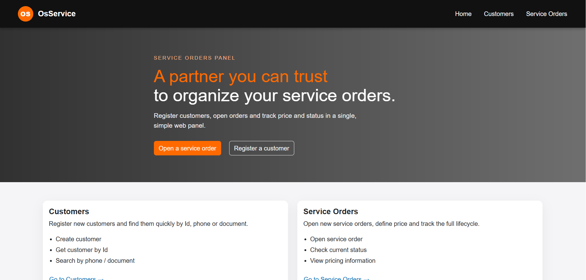
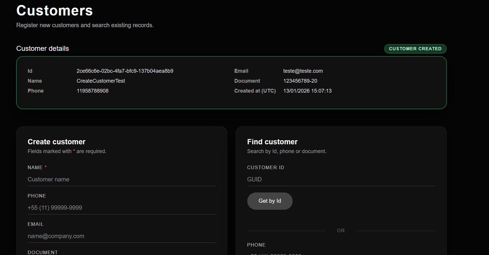
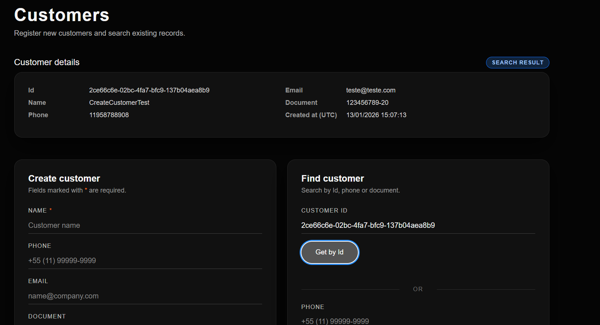
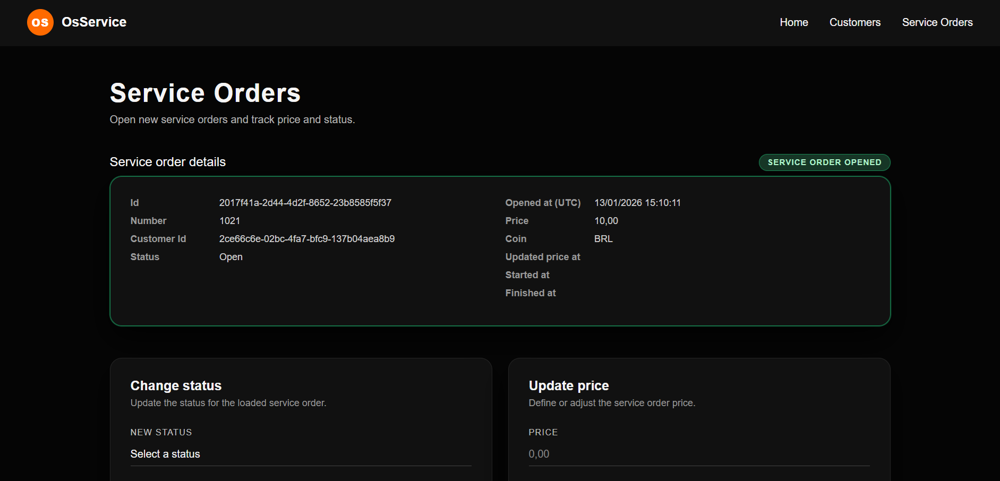
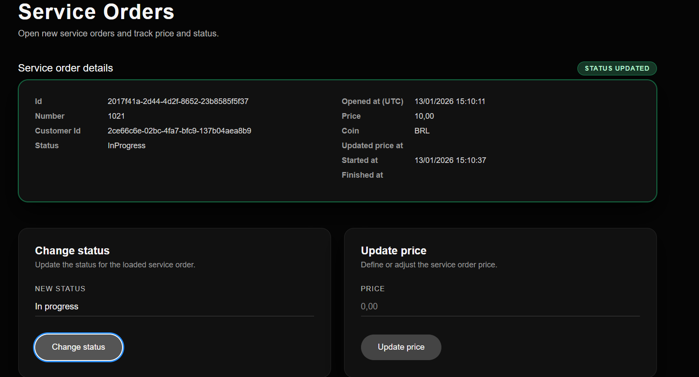
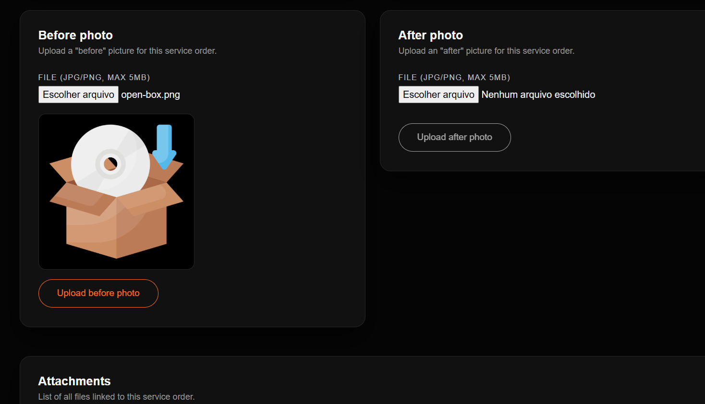
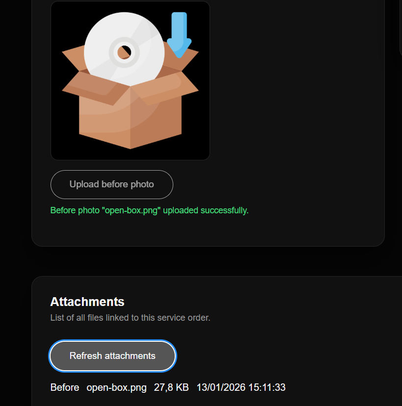

# OsService – Painel de Ordens de Serviço

OsService é uma aplicação full-stack simples para gerenciar **clientes** e **ordens de serviço**.

Ela expõe:

- Uma **API REST** (ASP.NET Core) para clientes, ordens e anexos  
- Um **painel web em Blazor Server** para cadastrar clientes, abrir ordens, alterar status, atualizar preço e fazer upload de fotos *antes/depois*  
- Uma suíte de **testes unitários** focada nas regras de negócio (atualmente **31 testes**)

---

## Sumário

- [Arquitetura e estrutura da solução](#arquitetura-e-estrutura-da-solução)
- [Visão de domínio](#visão-de-domínio)
- [Endpoints da API](#endpoints-da-api)
- [Tratamento de erros e status HTTP](#tratamento-de-erros-e-status-http)
- [Armazenamento de anexos](#armazenamento-de-anexos)
- [Aplicação Web](#aplicação-web)
- [Como executar o projeto](#como-executar-o-projeto)
  - [Pré-requisitos](#pré-requisitos)
  - [Subindo a infraestrutura com Docker](#subindo-a-infraestrutura-com-docker)
  - [Executando a API](#executando-a-api)
  - [Executando o Web UI](#executando-o-web-ui)
- [Swagger](#swagger)
- [Testes unitários](#testes-unitários)
- [Screenshots](#screenshots)
- [Possíveis evoluções](#possíveis-evoluções)

---

## Arquitetura e estrutura da solução

A solução segue um modelo **feature-based (vertical slice)** sobre um núcleo em camadas:

```text
src/
  OsService.Domain/            # Entidades, enums e conceitos de domínio
  OsService.Infrastructure/    # Repositórios e acesso a SQL Server
  OsService.Services/          # Camada de aplicação (casos de uso / handlers)
    V1/
      Customers/
        CreateCustomer/
          CreateCustomerCommand.cs
          CreateCustomerHandler.cs
        GetCustomerById/
        SearchCustomers/
      ServiceOrders/
        OpenServiceOrder/
        ChangeStatus/
        UpdatePrice/
        Attachments/
          UploadBeforeAttachment/
          UploadAfterAttachment/
          GetServiceOrderAttachments/
        GetServiceOrderById/
  OsService.ApiService/        # Web API ASP.NET Core (controllers, DI, middleware)
  OsService.Web/               # Painel web Blazor Server

tests/
  OsService.Services.UnitTests/
    V1/
      Customers/
      ServiceOrders/
        OpenServiceOrder/
        ChangeStatus/
        UpdatePrice/
```

### Tecnologias

- **.NET 10**
- **ASP.NET Core Web API** + **Blazor Server**
- **SQL Server** (via um repositório simples)
- Handlers no estilo **MediatR** para cada caso de uso
- **xUnit** + **Moq** para testes unitários

---

## Visão de domínio

### Clientes

Um cliente possui:

- `Id` (Guid)  
- `Name`  
- `Phone`  
- `Email`  
- `Document` (CPF/CNPJ ou similar)  
- `CreatedAtUtc`  

Regras principais:

- `Name`, `Phone`, `Email` e `Document` são obrigatórios.  
- Há validações de tamanho e limpeza de dados.  
- Criação inválida resulta em erro de validação.

### Ordens de serviço

Uma ordem de serviço possui:

- `Id` (Guid)  
- `Number` (inteiro sequencial)  
- `CustomerId` (deve referenciar um cliente existente)  
- `Description` (obrigatório, máx. 500 caracteres)  
- `Price` (opcional na abertura, não pode ser negativo)  
- `Coin` (fixo como BRL neste desafio)  
- `Status` (`Open`, `InProgress`, `Finished`)  
- `OpenedAt`, `UpdatedPriceAt`, `StartedAt`, `FinishedAt`  

Regras principais:

- Só é possível abrir ordem para cliente existente.  
- `Description` é obrigatória e limitada a 500 caracteres.  
- `Price`:
  - pode ser **nulo** enquanto a OS estiver em `Open` ou `InProgress`;  
  - não pode ser negativo;  
  - é **obrigatório** para finalizar a OS (`Finished`).

### Regras de transição de status

(Implementadas em `ChangeServiceOrderStatusHandler`):

- **Status inicial:** `Open` (Aberta).  

**De `Open` (Aberta):**

- Pode ir para `InProgress` (Em Execução)  
  - Ao fazer essa transição, `StartedAt` é preenchido se ainda estiver nulo.  
- Tentativa de ir direto para `Finished` é rejeitada com `ConflictException`  
  (`"Service order must be in progress before being finished."` – HTTP 409).

**De `InProgress` (Em Execução):**

- Pode ir para `Finished` (Finalizada) **apenas se**:
  - `Price` estiver definido;  
  - `Price` for maior que zero.  
- Caso contrário, é lançada `ValidationException` com mensagens como:  
  - `"Price is required to finish the service order."`  
  - `"Price cannot be negative."`  
- Se `StartedAt` ainda for nulo, é preenchido com o instante atual.  
- `FinishedAt` é preenchido no momento da finalização.

**De `Finished` (Finalizada):**

- Qualquer tentativa de mudança de status é rejeitada com `ConflictException` (HTTP 409):  
  `"Finished service orders cannot change status."`

---

### Atualização de preço

O `UpdateServiceOrderPriceHandler`:

- Garante que o preço foi informado e é positivo.  
- Permite definir ou ajustar `Price` enquanto a ordem está em `Open` ou `InProgress`.  
- **Após a OS estar em `Finished`**, qualquer tentativa de alteração de preço é rejeitada com `ConflictException` (HTTP 409).  
- Atualiza `Price` e `UpdatedPriceAt`.

---

## Endpoints da API

Todos os endpoints da versão 1 ficam sob `/v1`.

### Customers

**POST `/v1/customers`**  
Cria um novo cliente.  
Retorna **201 Created** com header `Location` e o recurso criado.

**GET `/v1/customers/{id}`**  
Retorna um cliente pelo `Id`.

**GET `/v1/customers/search?phone=...&document=...`**  
Busca clientes por telefone e/ou documento.

### Service orders

**POST `/v1/service-orders`**  
Abre uma nova ordem de serviço para um cliente existente.

Exemplo de body:

```json
{
  "customerId": "guid",
  "description": "texto até 500 caracteres",
  "price": 100.00
}
```

Retorna o `Id` e o `Number` gerado.

**GET `/v1/service-orders/{id}`**  
Retorna todos os detalhes de uma ordem.

**PATCH `/v1/service-orders/{id}/status`**  
Body:

```json
{ "newStatus": "InProgress" }
```

Aplica as regras de transição descritas acima.

**PATCH `/v1/service-orders/{id}/price`**  
Body:

```json
{ "price": 123.45 }
```

Atualiza o preço da ordem, respeitando as regras:

- permitido em `Open` e `InProgress`;  
- bloqueado em `Finished`.

### Attachments

**POST `/v1/service-orders/{id}/attachments/before`**  
**POST `/v1/service-orders/{id}/attachments/after`**

Ambos:

- Recebem um `multipart/form-data` com um arquivo (`file`).  
- Limitam tamanho a **5 MB**.  
- Salvam o arquivo em disco e os metadados em banco.

**GET `/v1/service-orders/{id}/attachments`**  
Retorna a lista de anexos da ordem, contendo:

- `Type` (`Before` / `After`)  
- `FileName`  
- `SizeBytes`  
- `UploadedAt`  

---

## Tratamento de erros e status HTTP

A API possui um **middleware global de exceções** que converte exceções de serviço em respostas HTTP padronizadas (similar a **ProblemDetails**).

Tipos customizados de exceção:

### ValidationException

- Erros de validação de entrada ou de regras de negócio.  
- Mapeada para **400 Bad Request** (ou **422** em alguns cenários).  
- Corpo da resposta contém uma mensagem clara.

### ConflictException

- Operação não permitida para o estado atual do recurso  
  (por exemplo, tentar alterar o status de uma ordem já finalizada ou alterar preço após `Finished`).  
- Mapeada para **409 Conflict**.

### KeyNotFoundException / NotFoundException

- Entidade não encontrada.  
- Mapeada para **404 Not Found**.

### Outras exceções

- Mapeadas para **500 Internal Server Error** com mensagem genérica.

Exemplo simplificado de payload de erro:

```json
{
  "type": "https://httpstatuses.com/400",
  "title": "Validation error",
  "status": 400,
  "detail": "Price is required to finish the service order."
}
```

### Cliente HTTP e ApiException

O projeto Blazor usa um `HttpClient` tipado (`OsServiceApiClient`) para falar com a API.

Uma extensão `EnsureSuccessWithApiErrorAsync`:

- Lê a resposta HTTP;  
- Em caso de erro, desserializa o payload de problema;  
- Lança `ApiException` com uma mensagem amigável.

Nas páginas, os métodos são envolvidos em `try/catch (ApiException ex)` e a mensagem é exibida em banners de sucesso/erro.  
Isso garante tratamento consistente em toda a UI.

---

## Armazenamento de anexos

Os anexos são gravados em disco, dentro da pasta do projeto:

```text
data/uploads/service-orders/{serviceOrderId}/before/{fileName}
data/uploads/service-orders/{serviceOrderId}/after/{fileName}
```

O fluxo dos handlers de upload:

1. Verifica se a ordem de serviço existe;  
2. Garante a criação das pastas (`Directory.CreateDirectory`);  
3. Salva o arquivo com o nome original;  
4. Persiste os metadados no banco (`SizeBytes`, `Type`, `UploadedAt`, etc).

Na UI:

- o usuário escolhe o arquivo;  
- é gerado um preview em memória usando `data:<contentType>;base64,...`;  
- o arquivo é enviado para a API via `MultipartFormDataContent`;  
- a lista de anexos é recarregada ao final do upload.

---

## Aplicação Web

O painel web em Blazor Server está em `OsService.Web`.

### Páginas principais

**Home**

- Hero com chamada principal para o painel de ordens.  
- Botões **“Open a service order”** e **“Register a customer”**.

**Customers**

- Topo: card com os detalhes do cliente carregado e *badge* de contexto:
  - `CUSTOMER CREATED`, `SEARCH RESULT`, etc.
- Coluna esquerda: formulário de criação de cliente.  
- Coluna direita: busca de cliente por Id, telefone ou documento.

**Service Orders**

- Card principal com todos os dados da ordem and *badge* contextual:
  - `SERVICE ORDER OPENED`, `STATUS UPDATED`, `PRICE UPDATED`.
- Painel de mudança de status com `select` estilizado.  
- Painel de atualização de preço.  
- Painéis de foto **Before** e **After**:
  - campo de arquivo;  
  - botão de upload;  
  - preview da última foto enviada.  
- Lista de anexos com botão **“Refresh attachments”**.

Todo o layout usa **tema escuro**, tipografia consistente e botões com bordas arredondadas.

---

## Como executar o projeto

### Pré-requisitos

- **.NET 10 SDK**  
- **Docker Desktop** (ou Docker Engine)  
- Opcional: ferramentas de cliente SQL Server (para inspecionar o banco)

Clone o repositório:

```bash
git clone https://github.com/<seu-usuario>/osservice.git
cd osservice
```

### Subindo a infraestrutura com Docker

O arquivo `docker-compose.yml` sobe os serviços de infraestrutura, incluindo SQL Server.

Exemplos:

```bash
# Subir apenas o SQL Server
docker compose up -d sqlserver

# Subir todos os serviços definidos
docker compose up -d
```

A API espera que o SQL Server esteja disponível na connection string configurada em `appsettings.Development.json`.  
Ajuste servidor/porta/usuário/senha caso necessário para o seu ambiente.

### Executando a API

Na raiz do repositório:

```bash
dotnet run --project src/OsService.ApiService
```

Por padrão a API ficará em algo como:

```text
https://localhost:7391
```

(Verifique `launchSettings.json` para a porta exata).

### Executando o Web UI

Em outro terminal:

```bash
dotnet run --project src/OsService.Web
```

O Blazor Server ficará disponível em algo como:

```text
https://localhost:7240
```

A aplicação web lê a URL da API da configuração (`ApiBaseUrl` em `appsettings.Development.json`) e deve apontar para a instância que você acabou de iniciar.

---

## Swagger

A API expõe **Swagger/OpenAPI** para exploração e testes dos endpoints.

Com a API rodando, acesse:

```text
https://localhost:7391/swagger
```

No Swagger você consegue:

- Ver a lista de endpoints organizada por feature;  
- Inspecionar contratos de request/response;  
- Executar chamadas diretamente contra a instância local.

---

## Testes unitários

Os testes ficam em:

```text
tests/OsService.Services.UnitTests
```

O foco está na camada de serviços/handlers, não em controllers nem em HTTP.

Atualmente existem **31 testes**, cobrindo:

### `OpenServiceOrderHandler`

- Validação de `CustomerId`, `Description`, `Price`;  
- Comportamento quando o cliente não existe;  
- Caminho feliz de criação.

### `ChangeServiceOrderStatusHandler`

- Ordem não encontrada;  
- Transições proibidas (por exemplo, tentar alterar uma ordem já finalizada);  
- De `Open` → `InProgress`;  
- De `InProgress` → `Finished` com e sem preço válido.

### `UpdateServiceOrderPriceHandler`

- Validação de preço;  
- Ordem não encontrada;  
- Rejeição quando a ordem está **finalizada (`Finished`)**;  
- Atualização correta de `Price` e `UpdatedPriceAt`.

### Handlers de clientes

(Criação, busca por Id, busca por telefone/documento):

- Campos obrigatórios;  
- Cenário de não encontrado;  
- Caminhos felizes.

Para rodar os testes:

```bash
dotnet test
# ou
dotnet test tests/OsService.Services.UnitTests
```

---

## Screenshots

As capturas abaixo mostram o fluxo completo do painel web.

> Dica: salve as imagens em `docs/images` no repositório com os nomes abaixo.















## Possíveis evoluções

Algumas ideias para trabalhos futuros:

- Adicionar testes de integração (API + banco) além dos testes unitários.  
- Paginação e ordenação em buscas de clientes e ordens.  
- Autenticação/autorização (por exemplo, JWT) para proteger o painel.  
- Endpoint dedicado para download de anexos (por exemplo, com URLs temporárias) em vez de servir diretamente do file system.  
- Mais validações e unicidade forte para clientes (documento, e-mail, etc.).

---

Feito com .NET 10 e muito café ☕
